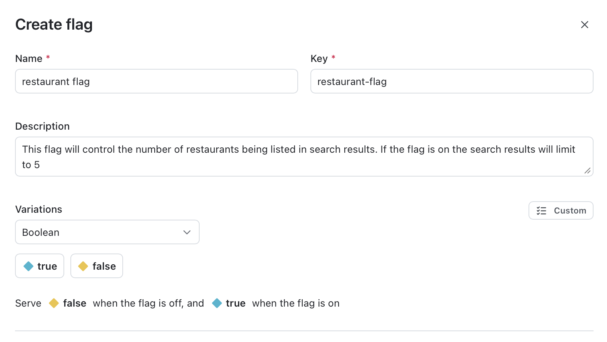
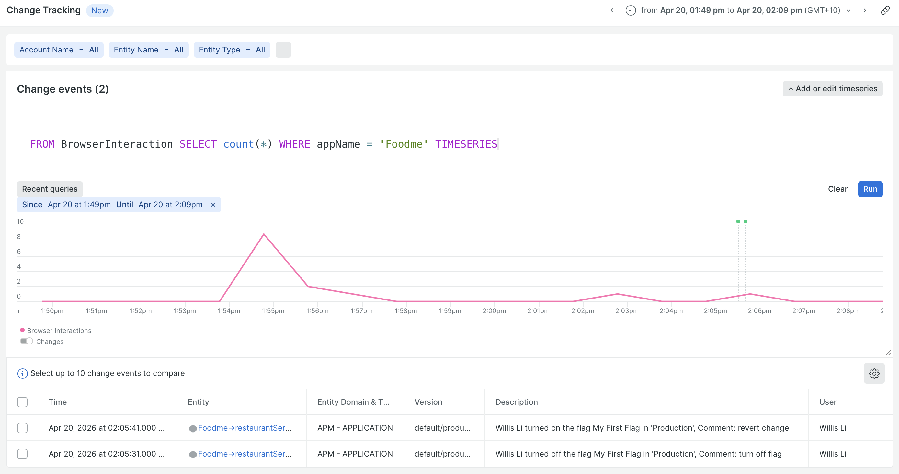
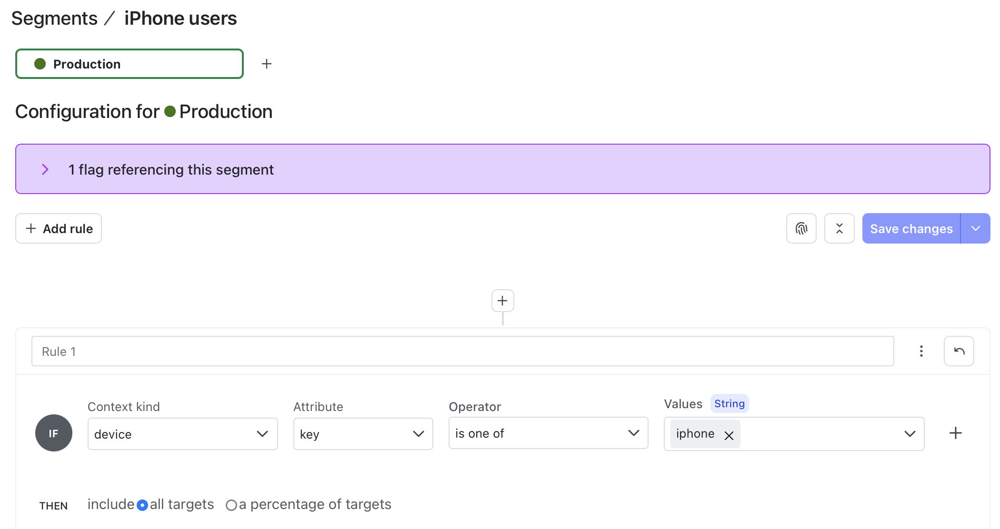
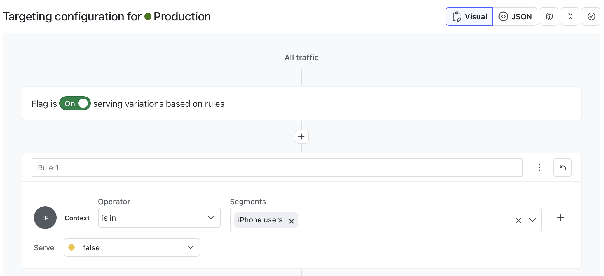

# ld-project
LaunchDarkly Project

We've built a project that demonstrates how the LaunchDarkly Node.js SDK works with sample application Relicstaurants

## Prerequisites

Please refer to [Relicstaurants repo](https://github.com/newrelic-experimental/relicstaurants.git) for its setup process. After you have setup Relicstaurants you can follow the instructions below to complete the rest of the steps in order to deploy LaunchDarkly SDK.

You would need access to a LaunchDarkly account. To sign up you can visit the [LaunchDarkly website](https://launchdarkly.com) and create an account using with your email address. 

## Build instructions

1. Install the LaunchDarkly Node.js Server-Side SDK
    ```
    npm install @launchdarkly/node-server-sdk
    ```
   
2. Make a copy of the `.env.template` and name it `.env`
    ```
    cp .env.template .env
    ```

3. Set the variables in `.env` to your specific LD values
   
   After you create an LD account, you can login to access your SDK KEY and FLAG KEY. You will need to create a new Boolean Feature Flag which will be used to control the number of restaurants being listed in search results. 
    ```
    # Set LAUNCHDARKLY_SDK_KEY to your LaunchDarkly SDK KEY
    LAUNCHDARKLY_SDK_KEY=

    # Set LAUNCHDARKLY_FLAG_KEY to the feature flag key you want to evaluate
    LAUNCHDARKLY_FLAG_KEY=
    ```

4. Installation
    ```bash
    make install
    ```

5. On the command line, run `make run` to get started
    ```bash
    make run
    ```
    > [!NOTE]
    > The `make run` simply open Relicstaurants app on a browser. If that is not working for you,
    > you can visit `http://localhost:3000/` in a browser for the same results.

The application will run continuously and react to the flag changes in LaunchDarkly.

## How it works

Once you create a Boolean Feature Flag you can use it to control the number of restaurants being listed in search results. 



To observe the flag changes, simply type in an address on the Relicstaurants landing page and click the Search button

If the Boolean Feature Flag is ON, the full list of restaurants will be displayed.
If the Boolean Feature Flag is OFF, the search results will limit to 5.

## Integration

LaunchDarkly supports third-party integrations to let you configure the product to your specific needs. In this project we have setup Integration with Observability platform New Relic, which LaunchDarkly sends feature flag change events to New Relic as deployment events. To learn how to set up this integration, read [Using the New Relic events integration](https://launchdarkly.com/docs/integrations/new-relic).



## LaunchDarkly Context and Segment

Relicstaurants application has been setup to collect Context info based on the `User-Agent` of the customers, therefore you can setup [Rule-based Segments](https://launchdarkly.com/docs/home/flags/rule-based-segments) as an example to target particular type of devices such as iPhone and return a specific experiences. The Context Kind of the `key` has been defined as `device`.

Here's how the Rule-based Segment can be setup and add to existing flag:




